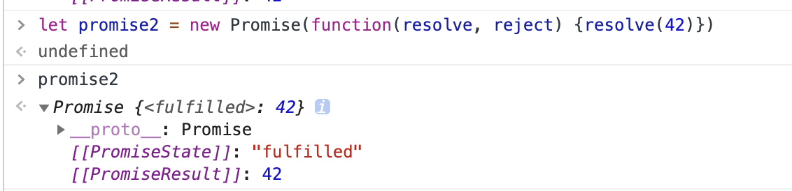
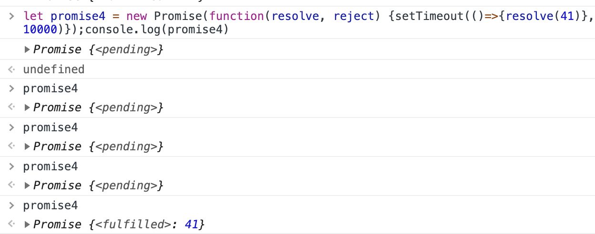
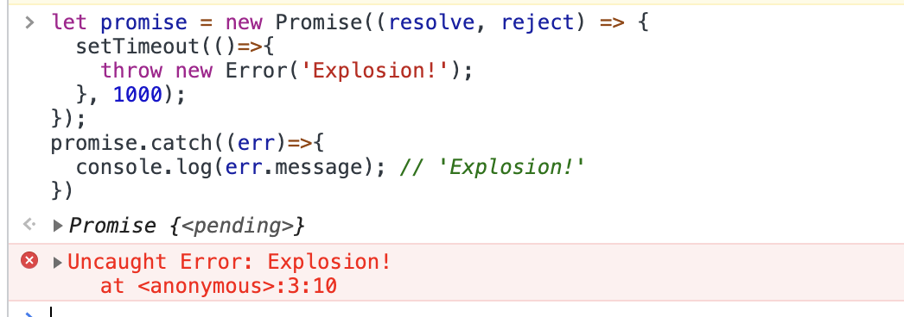

当更多程序开始使用异步编程时，事件和回调函数却不能满足开发者想做的所有事情，它们还不够强大，而Promise则是这些问题的解决方案。

### 异步编程的背景知识

JavaScript引擎是基于单线程（single-thread）事件循环的概念构建的，同一时刻只允许一个代码块在执行，与之相反的像Java和C++一样的语言，它们允许多个不同的代码块同时执行。对于基于线程的软件而言，当多个代码块同时访问并改变状态时，程序很难维护并保证状态不会出错。

JavaScript引擎同一时刻只能执行一个代码块，所以需要跟踪即将运行的代码块，那个代码被放在一个__任务队列__(job queue)中，每当一段代码准备执行时，都会被添加到任务队列。每当JavaScript引擎中的一段代码结束执行，事件循环（event loop）会执行队列中的下一个任务，它是JavaScript引擎中的一段程序，负责监控代码并管理任务队列。请记住，队列中的任务从第一个一直执行到最后一个。

#### 事件模型

事件模型适用于处理简单的交互。

```javascript
document.getElementById('my-btn').onclick = function(event){
  console.log('clicked!');
}
```

这段代码中，点击事件发生后，事件函数会被添加到任务队列中，只有当前的任务都完成后，它才会被执行。


#### 回调模式

Node.js通过普及回调函数来改进异步编程，回调模式和事件模式类型，异步代码都会在未来的某个时间点执行，二者的区别是回调模式中被调用的函数，是作为参数传入的。

```javascript
readFile('file.js', function(err, content) {
  if (err) {throw err}
  console.log(content);
});
console.log('hello');
```

回调函数作为参数传入， 存在的问题就是多层嵌套的时候，会创造出一堆难以理解和调试的代码。

```javascript
method1(function(err, result) {
  if (err) {throw err}
  method2(function(err, result) {
    if (err) {throw err}
    method3(function(err, result) {
			if (err) {throw err}
      method4(function(err, result) {
				...
      })
    })
  })
})
```

回调函数地狱就是这么来的。


---


### Promise的基础知识

Promise相当于异步操作结果的占位符，它不会去订阅一个事件，也不会传递一个回调函数给目标函数，而是让函数返回一个Promise，

```javascript
let promise = readFile('file.js'); // readFile承诺将在某个未来的时刻完成。
```

在这段代码中，readFile并不会立即开始读取文件，函数会先返回一个表示异步读取操作的Promise对象，未来对这个对象的操作完全取决于Promise的生命周期。

#### Promise的生命周期

每个Promise都会经历一个短暂的生命周期：

1. 先是出于进行中（pending）的状态，此时操作尚未完成，所以它也是未处理（unsettled）的
2. 一旦异步操作执行结束，Promised则编程已处理（settled）的状态。

已处理状态有以下两种：

* Fulfilled： Promise异步操作成功完成
* Rejected：由于程序错误或者一些别的原因，Promise异步操作未能成功完成。

内部属性[[PromiseState]]被用来表示Promise的3种状态：pending、fulfilled、rejected。这个属性并不暴露在promise对象上，所以不能以编程的方式来检测Promise的状态，只有当Promise状态改变时，通过then()方法来采取特定的行动。

所有Promise都有then()方法，接受两个参数，第一个是当Promise的状态变为fulfilled时要调用的函数，与异步操作相关的附加数据都会传递给这个完成函数（fulfillment function）；第二个是当promise状态变为rejected时要调用的函数，其与完成时调用的函数类似，所有与失败状态相关的附加数据都会传递给这个拒绝函数(rejection function)。


> 如果一个对象实现了上述的then()方法，那么这个对象我们称之为thenable对象。所有的Promise都是thenable对象，但并非所有的thenable对象都是Promise。


then()的两个参数是可选的，所以可以按照任意组合的方式来监听Promise，执行完成或被拒绝都会被响应。

```javascript
let promise = readFile('file.js');

promise.then(function(contents) {
  // 完成
}, function(err) {
  // 拒绝
});

promise.then(function(contents) {
  // 完成
});

promise.then(null, function(err) {
  // 拒绝
});
```

promise还有一个catch方法，相当于只给其传入拒绝处理程序的then()方法。

```javascript
promise.catch(function(err) {
  // 拒绝
});

等价于

promise.then(null, function(err) {
  // 拒绝
});
```

> 每次调用then()方法或catch()方法都会创建一个新的任务，当Promise被解决(resolved)时执行。这些任务最终都会被加入到一个为Promise量身定制的独立队列中。


#### 创建未完成的Promise

用Promise构造函数可以创建新的Promise，构造函数只接受一个函数：包含初始化Promise代码的执行器(executor)函数。执行器接受两个参数，分别是resolve()函数和reject()函数。执行器成功完成时调用resolve()函数，失败时调用reject()函数。

```javascript
// Node.js示例

let fs = require('fs');
function readFile(fileName) {
  return new Promise(function(resolve, reject) {
    // 触发异步操作
    readFile(fileName, {encoding: 'utf8'}, function(err, contents) {
      // 检查是否有错误
      if (err) {
      	reject(err);
        return;
      }
      // 成功读取文件内容
      resolve(content);
    })
  })
}

let promise = readFile('file.js');

promise.then(function(contents) {
  // 完成
  console.log(contents)
}).catch(function(err) {
  // 拒绝
  console.error(err.message);
})
```

readFile方法被调用时，执行器函数是立即执行的，在执行器中，不论是调用resolve()还是调用reject()，都会向任务队列中添加一个任务来解决这个Promise。

```javascript
let promise = new Promise(function(resolve, reject) {
  console.log('a promise');
  resolve()；// 向任务队列中添加解决的任务
});
promise.then(()=>{
  console.log('resolved');
});
console.log('Hello');

// 打印顺序
a promise
Hello
resolved
```

一旦调用resolve或者reject方法，就会修改Promise的状态，从Pending变成Fulfilled或者Rejected.


##### 状态改变的示例



promise2在执行器中，直接调用了resolve()方法，执行器是立即执行的，所以马上promise2的已处理状态就变成了fulfilled。



这边的promise4，在执行器中，通过延时10s的时间来调用resolve方法，所以可以看出前几次都处于pending的状态，最后10s过了，执行了resolve方法之后，状态才变成fulfilled。


#### 创建已处理的Promise

创建未处理的Promise的最好方法是使用Promise构造函数，这是由于Promise执行器具有动态性。如果想用Promise来表示一个已知值，用以下两种方法根据特定的值来创建已解决的Promise。

##### Promise.resolve()

Promise.resolve()方法只接受一个参数并返回一个完成态的Promise，也就是说并不会有任务编排过程，而且需要向Promise添加一至多个完成处理程序来获取值。

```javascript
let promise = Promise.resolve(43);
promise.then((val) => {
  console.log(val); // 43
})
```

##### Promise.reject()

也可以通过Promise.reject()方法来创建已拒绝的Promise，它与Promise.resolve()很像，唯一的区别是创建出来的是拒绝态的Promise。

```javascript
let promise = Promise.reject(42);
promise.catch((val) => {
  console.log(val); // 42
})
```

> 如果向Promise.resolve()或Promise.reject()传入一个Promise，那么这个Promise会被直接返回。

##### 非Promise的Thenable对象

如果给Promise.resolve()或Promise.reject()传入一个非Promise的Thenable对象作为参数。那么这些方法会创建一个新的Promise对象，并在then()函数中调用。

拥有then()方法，并且接受resolve和reject这两个参数的普通对象就是一个非Promise的Thenable对象。

```javascript
// 非Promise的Thenable对象
let thenable = {
  then: function(resolve, reject) {
    resolve(42);
  }
};

// 传入Promise.resolve，并返回一个新的Promise对象
let promise1 = Promise.resolve(thenable);
promise1.then(function(val){
  console.log(val); // 42
});
```

在上述示例中，Promise.resolve()调用的是thenable.then()，所以Promise的状态可以被检测到。由于在then中调用了resolve(42)，因此Thenable对象的Promise状态是已完成。新创建的已完成的Promise p1从Thenable对象接受传入的值（42），p1的完成处理程序将42赋值给形参val。


```javascript
let thenable2 = {
  then: function(resolve, reject) {
    reject(42);
  }
};

let promise2 = Promise.resolve(thenable2);
promise2.catch(function(val){
  console.log(val); // 42
});
```


#### 执行器错误

如果执行器内部抛出一个错误，则Promise的拒绝处理程序就会被调用。

```javascript
let promise = new Promise((resolve, reject) => {
  throw new Error('Explosion!');
});
promise.catch((err)=>{
  console.log(err.message); // 'Explosion!'
})
```

这段代码中执行器故意抛出了一个错误，每个执行器中都隐含一个try-catch语句块，所以错误会被捕获并传入拒绝处理程序。

```javascript
// 等价于
let promise = new Promise((resolve, reject) => {
  try {
    throw new Error('Explosion!');
  } catch(err) {
    reject(err);
  }
}); 
```

如果在执行器的异步进程中抛出一个错误，promise就无法进行捕获了。

```javascript
let promise = new Promise((resolve, reject) => {
  setTimeout(()=>{
  	throw new Error('Explosion!');
  }, 1000);
});
promise.catch((err)=>{
  console.log(err.message); // 'Explosion!'
})
```

执行示例如下：




---


### 全局的Promise拒绝处理

#### node.js环境的拒绝处理

在Node.js中，处理Promise拒绝时会触发process对象上的两个事件；

* unhandledRejection: 在一个事件循环中，当Promise被拒绝，并且没有提供拒绝处理程序时，触发该事件
* rejectionHandled: 在一个事件循环中，当Promise被拒绝时，如拒绝处理程序被调用，触发该事件。

unhandledRejection事件，设计是用来识别那些被拒绝但是又没有处理过的Promise的。

拒绝原因（通常是一个错误对象）以及被拒绝的Promise作为参数被传入事件中。

```javascript
let rejected;

process.on('unhandledRejection', function(reason, promise) {
  consoel.log(reason.message); // 'Explosion!'
  console.log(rejected === promise); // true
})
rejected = Promise.reject(new Error('Explosion!'));
```


rejectionHandled事件处理程序只有一个参数，也就是被拒绝的Promise对象。

```javascript
let rejected;

process.on('rejectionHandled', function(promise) {
  console.log(rejected === promise); // true
})
rejected = Promise.reject(new Error('Explosion!'));

// 等待添加拒绝处理函数
setTimeout(()=>{
  rejected.catch((err) => {
    console.log(err.message); // 'Explosion!'
  })
}, 1000);
```

这边有个setTimeout，是因为如果在创建rejected之后，直接添加拒绝处理程序，那么rejectionhandled事件不会被触发，因为rejected创建的过程与拒绝处理函数的调用在同一个事件循环中，此时rejectionHandled事件还未生效。

#### 浏览器环境的拒绝处理

浏览器也是通过触发两个事件来识别未处理的拒绝的，虽然事件是在window对象上的，但是和Node.js中的完全等效。

* unhandledrejection: 在一个事件循环中，当Promise被拒绝，并且没有提供拒绝处理程序时，触发该事件
* rejectionhandled: 在一个事件循环中，当Promise被拒绝时，如拒绝处理程序被调用，触发该事件。

在浏览器中，事件处理程序接受一个有以下属性的事件对象作为参数：

* type: 事件名称('unhandledrejection' 或'rejectionhandled')
* promise: 被拒绝的promise对象
* reason: 来自promise的拒绝值

浏览器中的另外一个不同是，两个事件中都可以使用拒绝值。

```javascript
let rejected;

window.onunhandledrejection = function(event) {
  console.log(event.type); // 'unhandledrejection'
  console.log(event.reason.message); // 'Explosion!'
  console.log(event.promise === rejected); // true
};

window.onrejectionhandled = function(event) {
  console.log(event.type); // 'rejectionhandled'
  console.log(event.reason.message); // 'Explosion!'
  console.log(event.promise === rejected); // true
};

rejected = Promise.reject(throw new Error('Explosion!'));
```


---


### 串联Promise

每次调用then()方法或catch()方法时，实际上创建并返回了另一个Promise，只有当第一个Promise完成或被拒绝后，第二个才会被解决。

```javascript
let p1 = new Promise((resolve, reject) => {
  resolve(42);
})

p1.then((val) => {
  console.log(val)
}).then(() => {
  console.log('Finished');
})

// 输出
42
Finished
```

调用p1.then()后返回第二个Promise，紧接着又调用它的then()方法，只有当第一个Promise被解决之后，才会调用第二个then()方法的处理程序。

#### 捕获错误

```javascript
let p1 = new Promise((resolve, reject) => {
  resolve(42);
})

p1.then((val) => {
  throw new Error('Boom!');
}).catch((err) => {
  console.log(err.message); // 'Boom!'
})
```

> 务必在Promise链的末尾留有一个拒绝处理程序以确保能够正确处理所有可能发生的错误。

#### Promise链的返回值

Promise链的另一个重要特性是可以给下游Promise传递数据。如果在完成处理程序中指定一个返回值，则可以沿着这条链继续传递数据

```javascript
let p1 = new Promise((resolve, reject) => {
  resolve(42);
})

p1.then((val) => {
  console.log(val); // 42
  return val + 1;
}).then((val) => {
  console.log(val); // 43
})
```

在拒绝处理函数中，return也可以做同样的事情，传递数据给下游的Promise。

#### 在Promise链中返回Promise

如果返回的是一个Promise，会通过一个额外的步骤来确定下一步怎么走。

```javascript
let p1 = new Promise((resolve, reject) => {
  resolve(42);
})
let p2 = new Promise((resolve, reject) => {
  resolve(43);
})

p1.then(function(value){
  // 第一个完成处理程序
  console.log(value); // 42
  return p2;
}).then(function(value) {
  console.log(value); // 43
})
```

在这段代码中，p1编排的任务解决并传入p2，然后p1的完成处理程序返回一个已解决状态的Promise p2，由于p2已经被完成，因此第二个完成处理程序被调用，如果p2被拒绝，则调用拒绝处理程序。

关于这边需要注意的是，第二个完成处理程序是被添加到了返回的新的，第三个Promise上去，而不是p2

```javascript
let p3 = p1.then(function(value){
  // 第一个完成处理程序
  console.log(value); // 42
  return p2;
});
p3.then(function(value) {
  console.log(value); // 43
})
```


### 响应多个Promise

提供两个方法来监听多个Promise。

* Promise.all()
* Promise.race()

#### Promise.all()

Promise.all()方法只接受一个参数并返回一个Promise，该参数是一个含有多个受监听Promise的可迭代对象（如一个数组），只有当可迭代对象中的所有Promise都被解决完成之后返回的Promise才会被解决。__只有当可迭代对象中所有Promise都被完成后返回的Promise才会被完成。__

```javascript
let p1 = new Promise((resolve, reject) => {
  resolve(42);
})
let p2 = new Promise((resolve, reject) => {
  resolve(43);
})
let p3 = new Promise((resolve, reject) => {
  resolve(44);
})

let p4 = Promise.all([p1,p2,p3]);
p4.then(function(value){
  console.log(Array.isArray(value)); // true
  console.log(value); // [42,43,44];
})
```

只有当p1,p2,p3都完成后，p4才会被完成。传入p4完成处理程序的是一个包含每个解决值（42，43，44）的数组。这些值按照传入参数数组中Promise的顺序存储，所以可以根据每个结果来匹配对应的Promise。

所有传入Promise.all()方法的Promise只要有一个被拒绝，那么返回的Promise没等所有Promise都完成就立即被拒绝。

```javascript
let p1 = new Promise((resolve, reject) => {
  resolve(42);
})
let p2 = new Promise((resolve, reject) => {
  reject(43);
})
let p3 = new Promise((resolve, reject) => {
  resolve(44);
})

let p4 = Promise.all([p1,p2,p3]);
p4.catch(function(value){
  console.log(Array.isArray(value)); // false
  console.log(value); // 43
})
```


#### Promise.race()

Promise.race()方法有点不同：它也接受含多个受监视Promise的可迭代对象作为唯一参数并返回一个Promise，但只要有一个Promise被解决返回的Promise就被解决，无需等待所有Promise都完成。

```javascript
let p1 = Promise.resolve(42);
let p2 = new Promise((resolve, reject) => {
  resolve(43);
})
let p3 = new Promise((resolve, reject) => {
  resolve(44);
})

let p4 = Promise.all([p1,p2,p3]);
p4.then(function(value){
  console.log(value); // 42
})
```

实际上，传给Promise.race()方法的Promise会进行竞选，以决出那一个先被解决，如果先解决的事已完成Promise，则返回已完成Promise；如果先解决的是已拒绝Promise，则返回已拒绝Promise。

```javascript
let p1 = new Promise((resolve, reject) => {
  setTimeout(()=>{
    resolve(42);
  }, 1000);
})
let p2 = Promise.reject(43);
let p3 = new Promise((resolve, reject) => {
  resolve(44);
})

let p4 = Promise.all([p1,p2,p3]);
p4.catch(function(value){
  console.log(value); // 43
})
```

